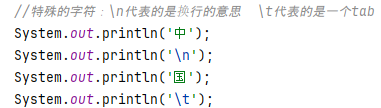
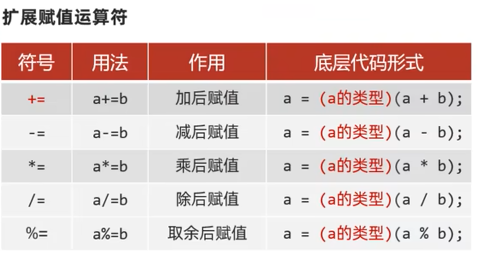
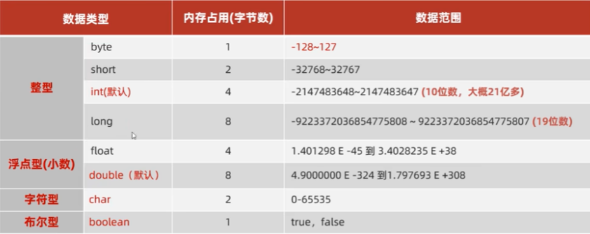
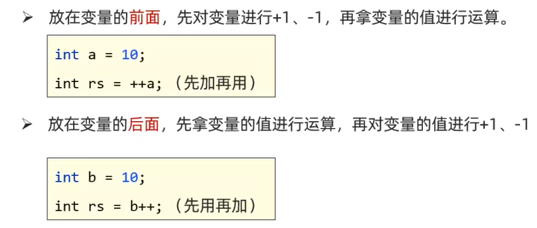
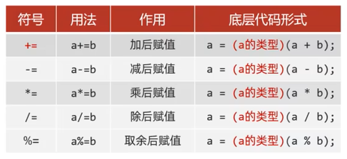
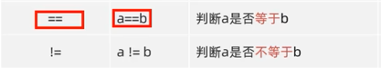
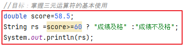

## Day1  
1. 包：在模块下的src中新建包，公司域名倒着写（小写（com.itheima.hello)）  
   类：在包上新建类（全部用英文,首字母大写(HelloWorld)）   
2. 变量名称：用英文，首字母小写，满足驼峰模式(int studyNumber=5;)  
3. 快捷键  
  
  
   
4. 基本数据类型  
  
引用数据类型：String（字符串类型）   
自动类型转换：类型范围小的变量，可以直接赋值给类型范围大的变量  
5. 基本的算数运算符  
/ 在java中两个整数相除结果还是整数  
％ 取余 获取的是两个数据做除法的余数  
6. 自增自减运算符  
  
7. 扩展赋值运算符  
  
8. 关系运算符  
  
9. 逻辑运算符  
&&：且 两个条件都满足   ||：或 满足其一即可  
  
10. 三元运算符  
格式：条件表达式？值1：值2；  
执行流程：首先计算关系表达式的值，如果值为true,返回值1，如果为false,返回值2  
  

